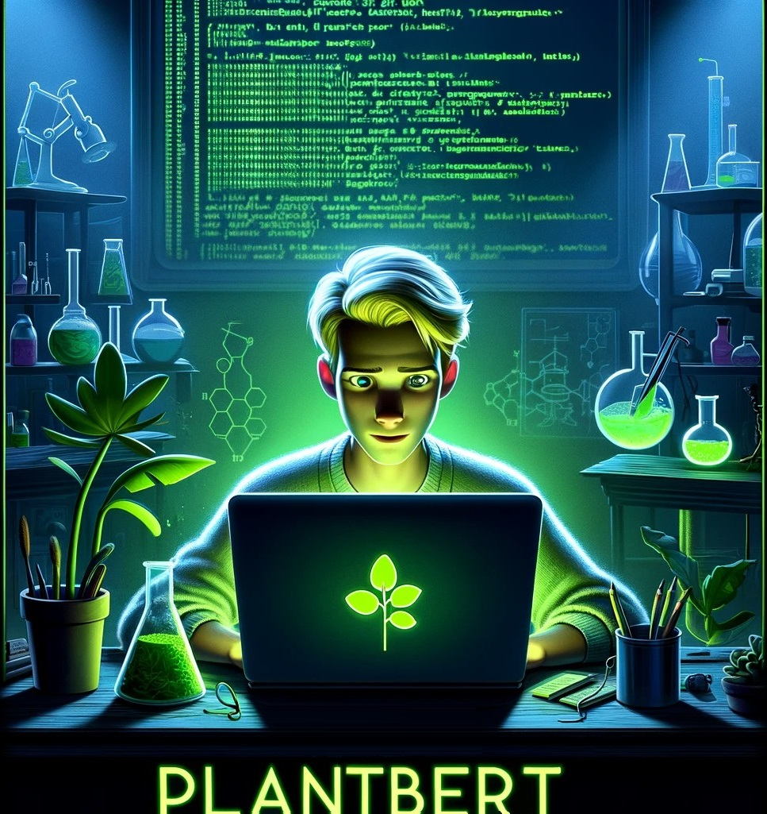

# myabe keep this repo for all files and call the project old_PlantBERT
new one is called just plantbert and just include the barepipeline which can be easily used with parameters not to much files.. one script for all

## 1: run and wait for resources
sbash 90_reserve_slurm_pre_processing.sh 
screen -S ... 
ssh ... 
srun -p medium -c 30 --mem-per-cpu 4G -t 5-00:00:00 --pty bash 
sh 90_run_pre_processing.sh
 
choose best tokenizer (propably last one) and cp ... vocabulary_final
 
sbash 91_reserve_slurm_pre_training.sh 
screen -S ...  
ssh ... 
srun -p gpu -G v100:8 -t 5-00:00:00 --pty bash 
python 05_tokenize_data_map_dataset.py plants 
python 06_pretrain.py plants 
  
